 
IS 601 Web System Development
Instructor: Keith Williams
kwilliam@njit.edu
 
IS601 852 & 854 Spring 2021
 

By

Emad Abdel hamid
&

Marcos Fermin 

Project Description
This is the final team project using Pycharm as an IDE with Docker as a host environment, Flask framework and, MySql database. We've collaborated on this project so we can each add a unique feature to work seamlessly with the web-application.
The code:
https://github.com/maf64/Final-Web-Application 
Project Team
This project consisted of two teammates myself Marcos Fermin, and Emad Abdel hamid
Features
Final Project WebURL:https://github.com/maf64/Final-Web-Application
 
Marcos’s Feature: 

The user can now add a certain city with all its details and the trip date, once the user creates the data the database will be updated.  

Home Page: 

User Creating Data:
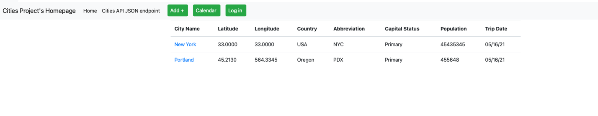
Home Page Updated:
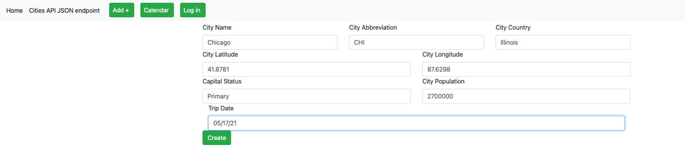
Updated Database: 
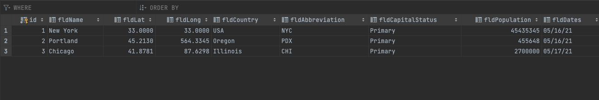

Emad’s Feature:

Login and activation email.
This feature allows the user to create an account which information will be stored in the database. Upon siginin up, a user will receive an activation email in the email address they entered in the registration form. When clicking on the activation ling in the email, the database record for that user wil;l be changed to reflect an active status. A user can use their newly created credentials to authenticate in to the website. An anuthenticated user wil not be able to view the cities’s table. However, after successful logging in, the user should be able to view the table and perform another functions.
The process of signing up and logging in is described below with screenshots;
 
Index.html does not display cities for unauthenticated users
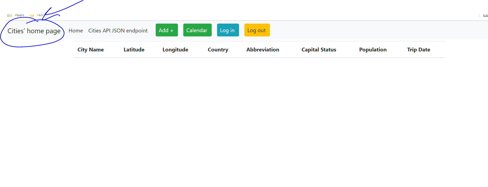
Login page

Form validation
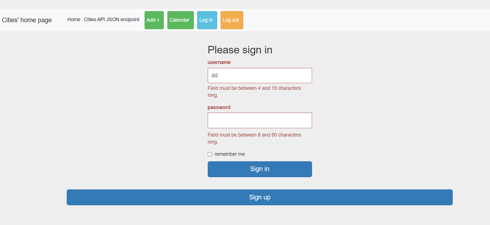
Unsuccessful authentication:
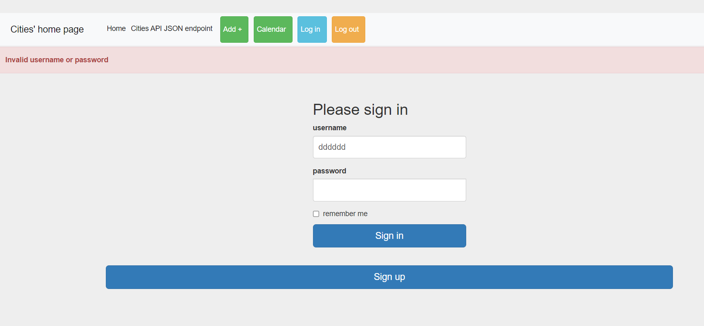
After successful authentication:
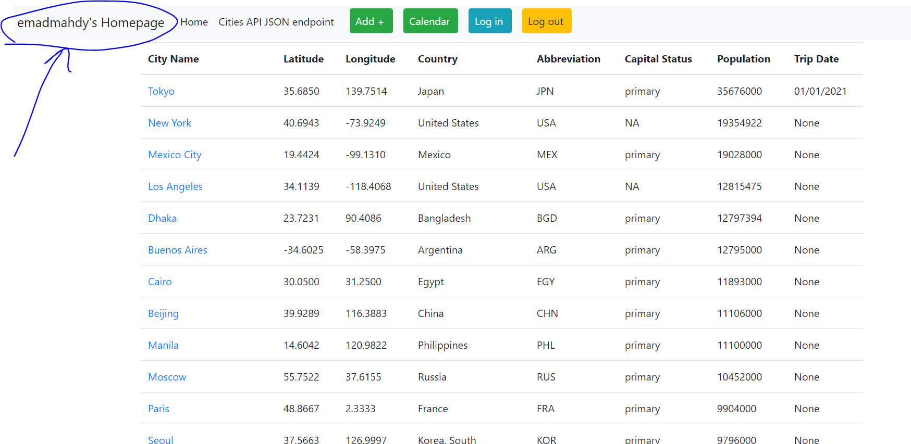
Signup page;
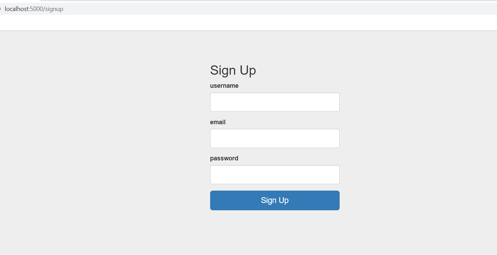
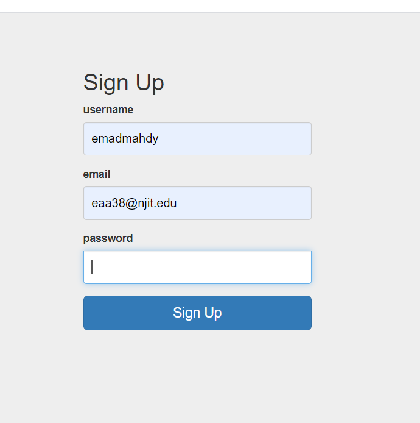
User created successfully:
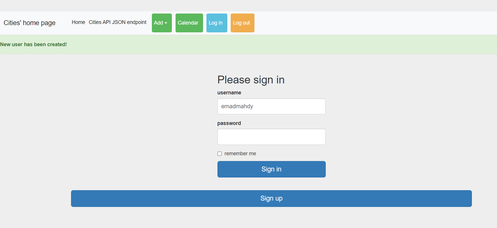
Confirmation email:
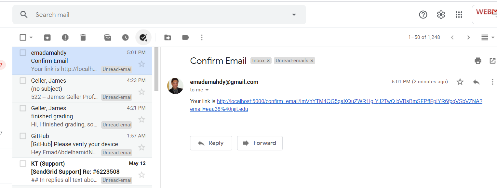
Clicking on the confirmation email:
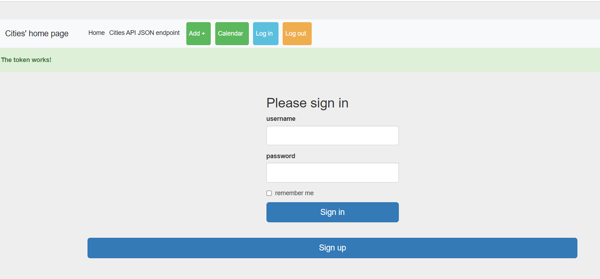
User has been activated in the DB
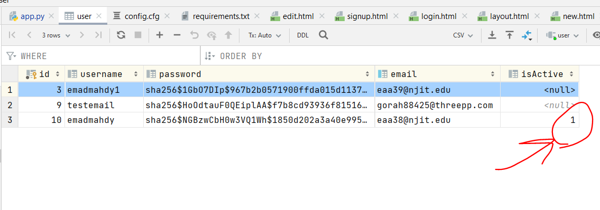
Login with the new user:
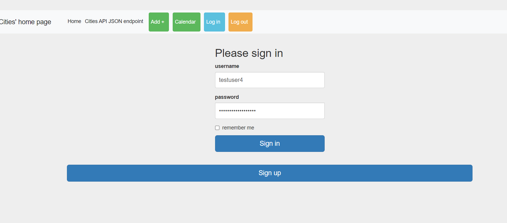
Successful login with new user:
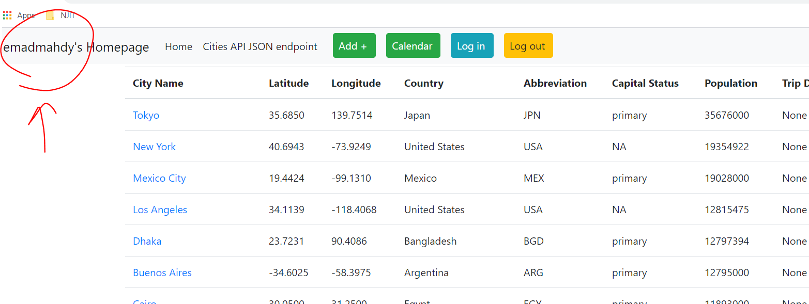
User stored in DB with hashed password:
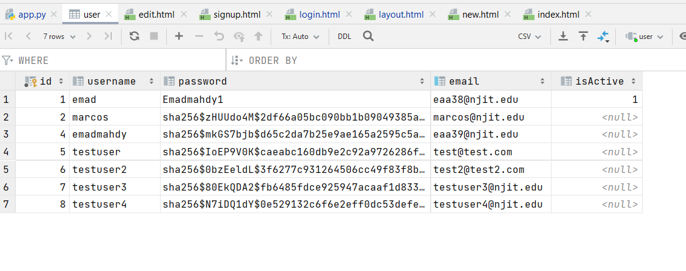
